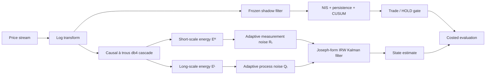

# CAMASE

**Causality-audited multiscale adaptive state estimation for high-frequency financial time series.**

[](https://www.python.org/)
[](#research-status)
[](#causality-audits)
[](#reproducibility)

CAMASE is an executable research artifact for estimating latent state in noisy, high-frequency financial series. It combines a **strictly causal à trous wavelet cascade**, **adaptive covariance mapping**, a **Joseph-form integrated random-walk Kalman filter**, and a **shadow-NIS regime gate**. The repository includes the estimator, a baseline ladder, causality audits, purged walk-forward evaluation, synthetic latent-truth experiments, a public BTCUSDT pilot, committed result tables, tests, and a browser-oriented TypeScript port.

> **Research status:** CAMASE is a methods and reproducibility project—not a production trading system and not a claim of alpha. The locked two-sided adaptor does not consistently beat simpler covariance baselines on the current generator; that negative result is reported rather than tuned away.

**Manuscript:** [PAPER.md](PAPER.md) · **Methods card:** [METHODS.md](METHODS.md) · **Published outputs:** [results/](results/)  
**Authors:** T. Shrikar, K. Sri Deepshikha, M. Mohith Srinivasa · ECE Batch 118  
**Guide:** Dr. Sai Krishna

---

## Abstract

High-frequency log-prices mix microstructure noise with genuine repricing events. A fixed-covariance Kalman filter may suppress noise only by accepting additional lag, while a scalar adaptive filter does not identify which temporal scales justify changing process or measurement uncertainty.

CAMASE studies whether a causal, undecimated wavelet cascade can separate short-scale and long-scale energy online. Short-scale energy updates measurement noise \(R_t\); long-scale energy updates process acceleration variance \(\sigma_{a,t}^2\). These covariances drive a numerically stable Kalman estimator, while an independently frozen shadow filter supplies a normalized-innovation-squared statistic for regime gating. The complete pipeline is evaluated against moving-average, static/adaptive Kalman, IMM, UKF, single-scale, gated, and deliberately leaky controls.

The contribution is methodological: every online coefficient is auditable for future leakage, evaluation is split according to whether latent truth is available, and unfavorable comparisons remain part of the published artifact.

---

## Why CAMASE?

| Research requirement | Common failure mode | CAMASE approach |
| :--- | :--- | :--- |
| **Online multiscale information** | Centered or periodic wavelets leak future samples | Causal FIR à trous cascade with explicit support and warm-up |
| **Adaptive uncertainty** | One scalar is adjusted without scale attribution | High-frequency energy maps to \(R_t\); low-frequency energy maps to \(Q_t\) |
| **Numerical stability** | Covariance loses symmetry or positive semidefiniteness | Joseph-form covariance update |
| **Regime detection** | The adaptive filter cancels its own innovation signal | Frozen shadow filter drives the NIS/CUSUM gate |
| **Honest evaluation** | Latent-state metrics are reported on market data without truth | Track A uses synthetic latent truth; Track B uses prediction/economic metrics only |
| **Leakage control** | Batch preprocessing contaminates walk-forward tests | Bitwise causality audits, purge, embargo, and prefix execution |
| **Research transparency** | Weak baselines or negative findings disappear | M0–M9 ladder, leaky twins, locked defaults, committed JSON outputs |

---

## Contributions

1. **Causal multiscale covariance adaptation** — a streaming db4 à trous cascade converts scale-specific energy into bounded updates of measurement and process uncertainty.
2. **Executable causality contract** — future-smash and streaming-prefix audits test the live implementation bit-for-bit; a circular twin acts as a positive leakage control.
3. **Shadow innovation gate** — regime evidence is computed using fixed nominal covariances so the adaptor cannot trivially normalize away its own alarms.
4. **Dual-track evaluation** — state-recovery claims are restricted to synthetic paths with latent truth, while market data is assessed with one-step prediction and costed walk-forward metrics.
5. **Refutable baseline ladder** — simple and advanced alternatives are evaluated under locked defaults, including results where M2 or M8 outperform the proposed M6 adaptor.
6. **Reproducible artifact** — deterministic seeds, hash-tracked datasets, tests, command-line experiments, and committed machine-readable tables support independent inspection.

---

## Method

### Signal and state model

The observation is log-price:

\[
y_t = \log \pi_t.
\]

The integrated random-walk state contains latent level and velocity. A causal wavelet cascade decomposes the observation into detail coefficients \(D_{j,t}\) and a coarse residual without periodic extension.

For a Daubechies-4 filter of length \(L=8\), the support at scale \(j\) is

\[
L_j = (2^j-1)(L-1)+1.
\]

With \(J=4\), the supports are \(8,22,50,106\) samples. Combined with a 64-sample variance window, the online warm-up is **169 samples**.

### Adaptive covariance map

The locked paper profile uses short scales \(\{1,2\}\) for measurement noise and long scales \(\{3,4\}\) for process noise:

\[
R_t = R_0\,\operatorname{clip}\left[\left(\frac{E_t^H}{\bar E_t^H}\right)^\alpha\right],
\qquad
\sigma_{a,t}^2 = \sigma_{a,0}^2\,\operatorname{clip}\left[\left(\frac{E_t^L}{\bar E_t^L}\right)^\beta\right].
\]

The default profile fixes \(\lambda=0.995\), \(\alpha=\beta=1\), a \(10\times\) clip, \(R_0=1.2\times10^{-7}\), and \(\sigma_{a,0}^2=2.5\times10^{-7}\). See [`camase/config.py`](camase/config.py) for the complete configuration contract.

### Regime gate

A shadow filter remains frozen at the nominal \((R_0,\sigma_{a,0}^2)\). Its innovations feed a 60-sample NIS window, a chi-square threshold, 3-of-5 persistence, and CUSUM parameters \((\kappa,H)=(1.6,36)\). This separates covariance adaptation from regime evidence.

### End-to-end flow



---

## Baseline ladder

| ID | Model | Role |
| :--- | :--- | :--- |
| `M0` | Moving-average baseline | Non-state-space reference |
| `M1` | Static Kalman filter | Fixed-covariance baseline |
| `M2` | Rolling-\(\sigma\) measurement noise | Simple adaptive \(R_t\) baseline |
| `M3` | Innovation-based adaptive estimation | Classical adaptive baseline |
| `M4` | Sage–Husa | Joint covariance adaptation |
| `M4b` | One-sided adaptive KF | Ratcheting adaptive baseline |
| `M5` | Single-scale wavelet adaptor | Ablation of multiscale attribution |
| `M6` | Two-sided multiscale adaptor | Primary CAMASE estimator |
| `M7` | Gated M6 | M6 with shadow-NIS HOLD logic |
| `M8` | Interacting multiple model | Discrete covariance-regime baseline |
| `M9` | Unscented Kalman filter | Nonlinear-filter reference on near-linear observation |
| `M6r` | Return-domain M6 | Specification check |
| `M5′–M7′` | Circular/centered twins | Deliberately leaky positive controls |

---

## Evaluation protocol

### Track A — latent-truth simulation

Heston-with-jumps paths provide observable latent truth under three regimes:

- **A1:** null / false-alarm study
- **A2:** regime-switching evaluation
- **A3:** stress and scheduled-jump evaluation

Valid metrics include price-state RMSE, velocity RMSE, SNR gain, mean NIS, jump hits/misses, and detection delay.

### Track B — public BTCUSDT pilot

The committed dataset contains **6,000 BTCUSDT one-minute klines** fetched from Binance's public API without an API key. Since latent state is unknown, Track B reports one-step MSPE, time in market, drawdown, trade count, and per-bar Sharpe after a **20 bp round-trip cost**. It does **not** report latent-state RMSE or SNR.

### Walk-forward controls

- Expanding-prefix execution
- Purge equal to the 169-sample warm-up
- Embargo equal to the fourth-scale support, \(L_4=106\)
- Four test folds in the committed Track B run
- Deflated Sharpe evaluated against the complete trial log

---

## Published findings

### Locked Track A2 run

The committed seed-42 run uses 1,800 observations after the same 169-sample warm-up contract.

| Model | Price RMSE | SNR (dB) | Mean NIS | One-step MSPE |
| :--- | ---: | ---: | ---: | ---: |
| M1 | 3.278e-4 | 0.063 | 1.987 | 1.451e-6 |
| M2 | 3.842e-4 | -1.206 | 0.429 | 5.861e-7 |
| M6 | 3.750e-4 | -0.797 | 2.264 | 7.732e-7 |
| M7 | 3.750e-4 | -0.797 | 2.264 | 7.732e-7 |
| **M8** | **2.991e-4** | **0.866** | **0.734** | 8.481e-7 |
| M9 | 3.278e-4 | 0.063 | 1.987 | 1.451e-6 |

### Robustness and diagnostics

- Across eight A2 seeds with \(n=1,200\), mean SNR was **-2.70 dB (M2)**, **-3.62 dB (M6)**, **-3.57 dB (M6r)**, and **+0.25 dB (M8)**.
- M8 beat M2 on all eight robustness seeds; M6 beat M2 on three of eight.
- Audits A and B pass bit-exactly; the circular twin differs as intended under Audit C.
- On the A3 diagnostic path, all five scheduled jumps were flagged within 20 bars, but the non-jump HOLD fraction was approximately **0.504**. Sensitivity and specificity must therefore be read together.
- The measured 50% response delay on a controlled 200 bp step was **0 bars**; this is a laboratory diagnostic, not an HFT execution-latency claim.

### Track B pilot

All committed costed, per-bar Sharpe estimates are negative. Across four purged folds, mean net Sharpe is approximately **-0.617 for M1** and **-0.621 for M6/M7**. The corresponding deflated-Sharpe probabilities are effectively zero. The pilot therefore provides **no evidence of tradable alpha**.

Machine-readable values and fold-level outputs are available in [`results/*.json`](results/).

---

## Causality audits

CAMASE treats causality as a testable software property:

- **Audit A — future smash:** mutate every sample after time \(t\), recompute, and require coefficients at \(t\) to remain bitwise identical.
- **Audit B — streaming/prefix equivalence:** require the streaming implementation to equal a fresh filter run on every available prefix.
- **Audit C — positive leakage control:** allow the circular centered twin to differ, then quantify the downstream economic difference instead of treating non-causality as an abstract warning.

Run the audit suite with:

```bash
python3 -m camase --audits
```

---

## Getting started

### Prerequisites

- Python 3.10+
- `pip`
- Git

### Installation

```bash
git clone https://github.com/ShrikarT/camase.git
cd camase
python3 -m venv .venv
source .venv/bin/activate  # Windows: .venv\Scripts\activate
python3 -m pip install --upgrade pip
python3 -m pip install -r requirements.txt
```

### Verify the artifact

```bash
python3 -m pytest tests/ -q
python3 -m camase --audits
```

### Run experiments

```bash
# Track A2 with selected models
python3 -m camase --track A2 --models M1,M2,M6,M7,M8,M9 --n 2000

# Ablation study
python3 -m camase --ablation --track A2 --n 2000

# Purged walk-forward study
python3 -m camase --walkforward --track A2 --n 2800

# Pareto analysis
python3 -m camase --pareto --track A2 --n 1600

# Diagnostics
python3 -m camase --diagnostics --out results/diagnostics.json

# Track B using the committed BTCUSDT window
python3 -m camase --track-b --csv data/btc_usdt_1m.csv
```

---

## Reproducibility

Regenerate the committed tables from the Python engine:

```bash
python3 scripts/reproduce_results.py
```

The script writes Track A, ablation, walk-forward, Pareto, calibration, false-alarm, diagnostic, and Track B outputs to `results/`. The default experiment seed is **42** unless a robustness run states otherwise. Locked constants live in [`camase/config.py`](camase/config.py); the `review2` profile is a labeled sensitivity analysis and does not replace paper defaults.

Fetch a fresh public BTCUSDT window with:

```bash
python3 -m camase --fetch-btc --pages 6 --csv data/btc_usdt_1m.csv
```

The loader writes a neighboring SHA-256 file. Keep the hash with any reported result. Network-free tests use the labeled synthetic fallback in `data/btc_sample.csv`.

---

## Repository structure

```text
camase/
├── camase/                 # Python research engine and CLI
│   ├── wavelet.py          # Causal à trous implementation
│   ├── adaptation.py       # Multiscale covariance mapping
│   ├── kalman.py           # Joseph-form IRW Kalman filter
│   ├── gate.py             # Shadow-NIS persistence/CUSUM gate
│   ├── models.py           # M0–M9 model ladder
│   ├── audits.py           # Executable causality audits
│   ├── walkforward.py      # Purged and embargoed evaluation
│   └── diagnostics.py      # Delay, leakage, jump, robustness studies
├── tests/                  # Audits, estimator, gate, Track B, IMM/UKF tests
├── scripts/                # Reproduction entry points
├── data/                   # Hash-tracked real and synthetic CSV inputs
├── results/                # Committed JSON tables
├── src/lib/camase/         # Browser-faithful TypeScript port
├── src/routes/             # Lab, ablation, audits, results, and paper views
├── PAPER.md                # Updated manuscript
└── METHODS.md              # One-page viva methods card
```

---

## Research integrity and limitations

- Track B covers only 6,000 one-minute bars—hours/days, not a market-scale historical study.
- Heston-with-jumps is a controlled data-generating process, not an exchange order book.
- M9 is evaluated on a nearly linear observation and should not be interpreted as evidence about strongly nonlinear market models.
- The step-response experiment measures estimator behavior under a laboratory tone, not exchange, networking, or execution latency.
- The default gate is conservative on A1 yet produces many non-jump HOLD states on A3.
- Hyperparameters must not be changed after observing a test fold merely to reverse the baseline ranking.
- Financial metrics are experimental outputs, not investment advice.

---

## Citation

If you use this repository in academic work, cite the repository and manuscript:

```bibtex
@software{shrikar2026camase,
  author  = {Shrikar, T. and Sri Deepshikha, K. and Mohith Srinivasa, M.},
  title   = {CAMASE: Causality-Audited Multiscale Adaptive State Estimation for High-Frequency Financial Time Series},
  year    = {2026},
  url     = {https://github.com/ShrikarT/camase},
  version = {2.1}
}
```

## References

The research spine includes Shensa (1992) and Quilty & Adamowski (2018) for wavelet causality; Renaud, Starck & Murtagh (2005) for wavelet/financial forecasting; Mehra (1970), Sage & Husa (1969), and Akhlaghi et al. (2017) for adaptive filtering; Aït-Sahalia, Mykland & Zhang (2005) for microstructure noise; and Bailey & López de Prado (2014) for deflated Sharpe. Full context is in [PAPER.md](PAPER.md).

---

## License

No open-source license is currently declared in this repository. Until a license is added, all rights remain with the copyright holders. Add an explicit license before encouraging reuse or redistribution.
