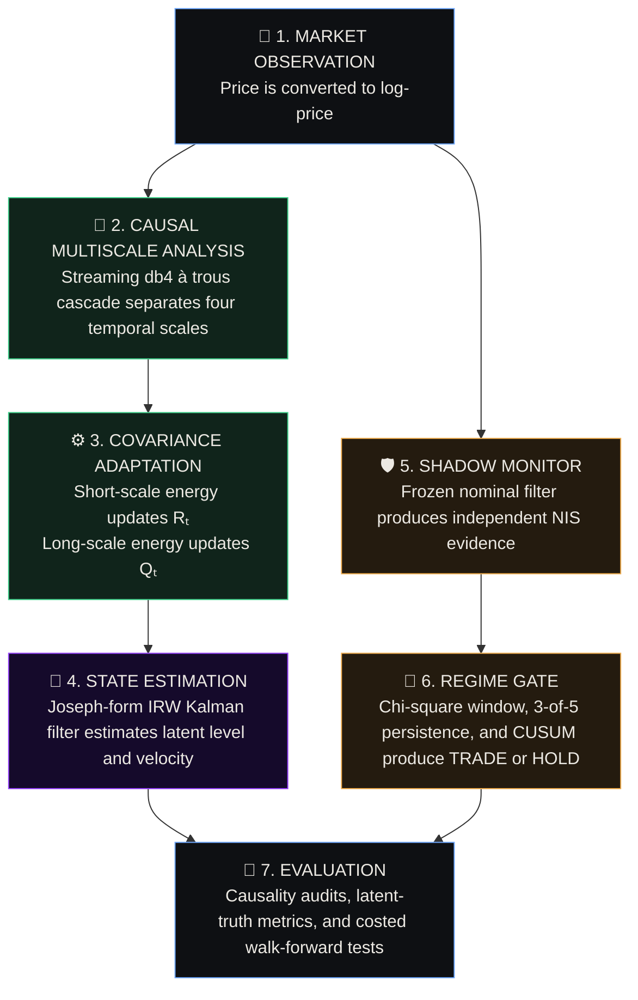
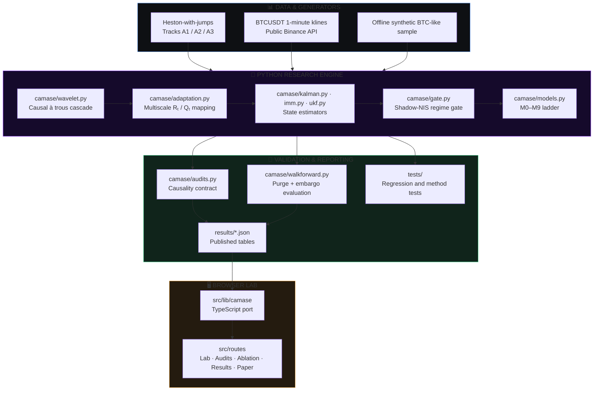

# CAMASE

**Causal estimation. Audited adaptation. Honest evidence.**

CAMASE is a research system for estimating latent state in noisy high-frequency financial time series. It combines strictly causal multiscale wavelets, adaptive Kalman filtering, independent regime gating, and leakage-audited evaluation in one reproducible artifact.

Manuscript: [PAPER.md](PAPER.md)  
Methods Card: [METHODS.md](METHODS.md)  
Research Status: **Experimental / Reproducible Artifact**

---

## What is CAMASE?

CAMASE is an online state-estimation pipeline designed for financial observations where **microstructure noise and genuine repricing occur at different temporal scales**.

Conventional estimators force a difficult choice:

1. **Strong smoothing**, which rejects noisy ticks but reacts slowly to real market movement.
2. **Fast tracking**, which responds to repricing but also follows transient microstructure noise.

CAMASE uses a strictly causal à trous wavelet cascade to measure energy across scales. Short-scale energy adapts measurement uncertainty \(R_t\), while long-scale energy adapts process uncertainty \(Q_t\). A Joseph-form Kalman filter then estimates latent level and velocity, and an independent shadow filter determines whether the system should trade or enter a HOLD state.

The project is built around a simple rule: **no performance claim without an executable causality and evaluation contract**.

---

## Why CAMASE?

| Capability | Standard Adaptive Filters | CAMASE |
| :--- | :--- | :--- |
| **Multiscale awareness** | Adapt one covariance from aggregate innovations. | Separates short-scale measurement noise from long-scale state movement. |
| **Online causality** | Batch transforms may use future observations or periodic boundaries. | **Causal FIR à trous cascade** with explicit support, warm-up, and no periodic extension. |
| **Regime detection** | Adaptation can suppress the innovations used to detect change. | **Frozen shadow filter** provides an independent NIS and CUSUM signal. |
| **Leakage protection** | Causality is assumed from implementation details. | **Bitwise future-smash and streaming-prefix audits** test it directly. |
| **Evaluation** | Latent-state metrics may be mixed with real-market metrics. | **Dual-track protocol:** truth-aware simulation and truth-free market evaluation. |
| **Baseline quality** | Proposed method is compared only with weak references. | Full **M0–M11 ladder**, return-domain checks, IMM, UKF, pre-averaging, wavelet-denoise, and leaky twins. |
| **Research integrity** | Hyperparameters or weak outcomes may be hidden. | Locked defaults, committed JSON tables, deterministic seeds, and negative results. |

---

## System

- **Causal Wavelet Engine**: Streaming Daubechies-4 à trous decomposition over four scales.
- **Two-Sided Adaptation**: Short-scale energy controls \(R_t\); long-scale energy controls \(\sigma_{a,t}^2\).
- **Stable State Estimation**: Integrated random-walk Kalman filter with Joseph covariance updates.
- **Shadow-NIS Gate**: Fixed-covariance innovations drive chi-square, persistence, and CUSUM checks.
- **Model Ladder**: Moving average, static KF, classical adaptive filters, wavelet variants, IMM, and UKF.
- **Causality Audits**: Bitwise checks against future leakage and streaming inconsistency.
- **Dual-Track Evaluation**: Latent-truth studies on three generators (A/B/C) and Heston tracks, plus public market walk-forward tests.
- **Reproducible Results**: Hash-tracked data, frozen seeds, tests, and committed machine-readable outputs.

---

## How It Works



The live path never uses centered coefficients or circular extension. With db4, \(J=4\), and a 64-sample variance window, CAMASE enforces a **169-sample warm-up** before scoring or acting on the estimator.

---

## Architecture



---

## Estimator Configuration

The locked paper profile is defined in [`camase/config.py`](camase/config.py).

| Parameter | Value | Purpose |
| :--- | :--- | :--- |
| Wavelet | `db4` | Four-scale causal decomposition |
| Ring buffer | `512` | Streaming coefficient history |
| Variance window | `64` | Local scale-energy estimation |
| Wavelet levels | `J = 4` | Short/long scale separation |
| High scales | `{1, 2}` | Measurement-noise adaptation |
| Low scales | `{3, 4}` | Process-noise adaptation |
| Warm-up | `169` bars | Largest support plus variance history |
| EWMA decay | `λ = 0.995` | Reference energy tracking |
| Exponents | `α = β = 1` | Covariance response |
| Covariance clip | `10×` | Bounds adaptive excursions |
| NIS window | `60` | Shadow innovation monitoring |
| Persistence | `3 of 5` | Regime confirmation |
| CUSUM | `κ = 1.6`, `H = 36` | Persistent-change detection |
| Trading cost | `20 bp` round trip | Costed economic evaluation |

The `review2` profile is a labeled sensitivity experiment. It does not replace or retrospectively tune the paper defaults.

---

## Model Ladder

| Model | Estimator | Purpose | Status |
| :--- | :--- | :--- | :--- |
| `M0` | Moving average | Non-state-space reference | **IMPLEMENTED** |
| `M1` | Static Kalman filter | Fixed-covariance baseline | **IMPLEMENTED** |
| `M2` | Rolling-σ adaptive R | Simple adaptive baseline | **IMPLEMENTED** |
| `M3` | Innovation-based adaptive estimation | Classical adaptive baseline | **IMPLEMENTED** |
| `M4` | Sage–Husa | Joint covariance adaptation | **IMPLEMENTED** |
| `M4b` | One-sided adaptive KF | Ratcheting covariance baseline | **IMPLEMENTED** |
| `M5` | Single-scale wavelet KF | Scale-attribution ablation | **IMPLEMENTED** |
| `M6` | Two-sided CAMASE | Primary multiscale estimator | **IMPLEMENTED** |
| `M7` | Gated CAMASE | M6 plus shadow-NIS HOLD logic | **IMPLEMENTED** |
| `M8` | Interacting multiple model | Discrete covariance-regime baseline | **IMPLEMENTED** |
| `M9` | Unscented Kalman filter | Nonlinear-filter reference | **IMPLEMENTED** |
| `M10` | Causal pre-averaging efficient price | Zhang–Mykland–Aït-Sahalia family baseline | **IMPLEMENTED** |
| `M11` | MODWT soft-threshold denoise + KF | Wavelet-as-competitor baseline | **IMPLEMENTED** |
| `M6r` | Return-domain CAMASE | Observation-domain check | **IMPLEMENTED** |
| `M5′–M7′` | Circular twins | Deliberately leaky controls | **AUDIT CONTROL** |

---

## Causality Audits

CAMASE makes causality executable rather than descriptive:

- **Audit A — Future Smash**: Replace all observations after time \(t\), recompute the transform, and require every coefficient at \(t\) to remain bitwise identical.
- **Audit B — Streaming Prefix**: Compare the online stream against a fresh filter run on each available prefix; outputs must match bit-for-bit.
- **Audit C — Circular Twin**: Run a deliberately non-causal centered/circular implementation and require a measurable difference. Its downstream economic effect is reported as the price of leakage.

```bash
python3 -m camase --audits
```

Audits A and B pass on the committed implementation. Audit C detects the leaky twin as designed.

---

## Evaluation

CAMASE separates experiments according to what can be measured honestly.

### Track A — Latent-Truth Simulation

Heston-with-jumps paths expose the hidden state and support RMSE, SNR, NIS, jump detection, and delay analysis. Three additional generators run on the same 1-minute clock: **A** (block-varying microstructure noise + slow latent random walk), **B** (bid-ask bounce + tick rounding + sparse jumps), and **C** (Heston-with-jumps, the original Track A2) — see `camase/generators.py`.

| Track | Scenario | Primary use |
| :--- | :--- | :--- |
| `A1` | Null regime | False-alarm calibration |
| `A2` | Regime path | State-estimation and ablation study |
| `A3` | Stress and scheduled jumps | Gate sensitivity and detection delay |

### Track B — Public Market Pilot

Two symbols × six months of public Binance 1-minute klines from the official archive (`data.binance.vision`, no key): **BTCUSDT and ETHUSDT, March–August 2026, 264,960 bars each, zero gaps** (`data/trackb_{BTC,ETH}USDT_1m.csv.gz` + `.sha256` sidecars; the original 6,000-bar file is kept in `data/` for provenance, superseded). Since the true latent state is unavailable, evaluation is limited to one-step MSPE, calibration, time in market, trade count, drawdown, and costed Sharpe — in that order, Sharpe last and never as the headline. Track B is a pilot, not evidence.

Walk-forward evaluation uses:

- expanding training prefixes;
- a 169-bar purge;
- a 106-bar embargo;
- six committed test folds per symbol;
- 20 bp round-trip costs; and
- deflated Sharpe over the complete trial log.

---

## Published Results

### Track A2 — Locked Seed 42

| Model | Price RMSE | SNR (dB) | Mean NIS | MSPE |
| :--- | ---: | ---: | ---: | ---: |
| `M1` | 3.278e-4 | 0.063 | 1.987 | 1.451e-6 |
| `M2` | 3.842e-4 | -1.206 | 0.429 | **5.861e-7** |
| `M6` | 3.750e-4 | -0.797 | 2.264 | 7.732e-7 |
| `M7` | 3.750e-4 | -0.797 | 2.264 | 7.732e-7 |
| `M8` | **2.991e-4** | **0.866** | **0.734** | 8.481e-7 |
| `M9` | 3.278e-4 | 0.063 | 1.987 | 1.451e-6 |

### Robustness

Across eight A2 seeds at \(n=1,200\):

| Model | Mean SNR | Wins vs. M2 |
| :--- | ---: | ---: |
| `M2` | -2.70 dB | — |
| `M6` | -3.62 dB | 3 / 8 |
| `M6r` | -3.57 dB | 2 / 8 |
| `M8` | **+0.25 dB** | **8 / 8** |

The locked M6 adaptor does **not** reliably outperform M2 on the current generator. M8 is the strongest covariance-family result in the robustness panel. This is a published result, not a hidden failure.

### Multi-generator results (50 seeds × 3 generators × 3 lengths)

Paired Wilcoxon tests, M6 vs M2 / M8, on SNR gain (full table: `results/multigen.json`). Mean SNR at \(n=1800\):

| Generator | M2 | M6 | M8 | M6 vs M2 | M6 vs M8 |
| :--- | ---: | ---: | ---: | :--- | :--- |
| `A` (block noise) | **+2.26** | +1.42 | +1.32 | −0.84 dB, 0/50 | +0.09 dB, 50/50 |
| `B` (bounce+jumps) | +0.88 | **+1.26** | +1.26 | +0.14 dB, 50/50 | tie, n.s. |
| `C` (Heston 1m) | −1.09 | −2.43 | **+0.92** | −1.37 dB, 7/50 | −3.29 dB, 0/50 |

M6 beats rolling-σ only on generator B, where short-scale energy is measurement noise by construction. Thesis: scale-split adaptation is identified only when short-scale and long-scale energy are separable.

### Gate and Market Findings

- A3 scheduled jumps: **5/5 detected** within the 20-bar horizon — but the gate ROC (`results/gate_roc.json`, 12 configurations) shows the gate was already HOLD before 100% of A3 jumps with a 0.91 false-hold fraction on non-jump bars. The window-NIS statistic saturates under stress: the gate is a panic button, not a detector.
- A3 non-jump HOLD fraction: approximately **0.504** on the diagnostic path (n=1800), so sensitivity is not equivalent to specificity.
- Controlled 200 bp step: measured 50% response delay of **0 bars**.
- Track B (BTC+ETH, 6 months each): best one-step MSPE is M2 on both symbols; costed per-bar Sharpe is **negative for every model** (−0.46 to −0.58) with deflated Sharpe 0.000.
- The Track B pilot provides **no evidence of tradable alpha** after costs.

All source tables are committed in [`results/`](results/).

---

## Getting Started

### Prerequisites

- Python >= 3.10
- pip
- Git

### Installation

```bash
git clone https://github.com/ShrikarT/camase.git
cd camase
python3 -m venv .venv
source .venv/bin/activate  # Windows: .venv\Scripts\activate
python3 -m pip install --upgrade pip
python3 -m pip install -r requirements.txt
```

### Testing & Audits

```bash
python3 -m pytest tests/ -q
python3 -m camase --audits
```

### Experiments

```bash
# Track A model comparison
python3 -m camase --track A2 --models M1,M2,M6,M7,M8,M9 --n 2000

# Full ablation
python3 -m camase --ablation --track A2 --n 2000

# Purged walk-forward evaluation
python3 -m camase --walkforward --track A2 --n 2800

# Diagnostic suite
python3 -m camase --diagnostics --out results/diagnostics.json

# Track B market pilot (2 symbols x 6 months)
python3 -m camase.fetch_archive "BTCUSDT,ETHUSDT" "" data

# Multi-generator statistics (50 seeds x 3 generators x 3 lengths)
python3 -m camase.multigen results

# Gate ROC (false alarms on A1 vs hit rate on A3)
python3 -c "from camase.gate_roc import main; main('results/gate_roc.json')"

# Fetch a fresh public BTCUSDT window
python3 -m camase --fetch-btc --pages 6 --csv data/btc_usdt_1m.csv
```

### Reproduce Published Tables

```bash
python3 scripts/reproduce_results.py          # full, ~25 min (50-seed table)
python3 scripts/reproduce_results.py --light  # CI-fast tables
```

The script regenerates the committed Track A, ablation, walk-forward, Pareto, calibration, false-alarm, diagnostic, gate-ROC, identification, multi-generator, and Track B outputs.

---

## Documentation

For the full research specification, implementation details, and evidence, see:

- [**Updated Manuscript**](PAPER.md) — Motivation, related work, method, protocol, findings, and limitations.
- [**Methods Card**](METHODS.md) — One-page estimator, defaults, evaluation, and viva reference.
- [**Published Results**](results/README.md) — How to interpret the committed JSON tables.
- [**Track B Data**](data/README.md) — Dataset provenance, synthetic fallback, and SHA-256 rules.
- [**Locked Configuration**](camase/config.py) — Paper and sensitivity profiles.
- [**Causality Tests**](tests/test_audits.py) — Executable future-leakage contract.

---

## Research Limitations

- Track B is two crypto symbols over six months of 1-minute bars — a pilot, not a market study. No equity tape was reachable without keyed data.
- Heston-with-jumps is a controlled generator, not an exchange order book.
- M9 uses a nearly linear observation and is not a broad nonlinear-market claim.
- Step-response delay is an estimator diagnostic, not an execution-latency benchmark.
- The current gate is conservative under A1 and saturates (always HOLD) under A3 stress.
- CAMASE is research software, not financial advice or a production trading system.

---

## Citation

```bibtex
@software{shrikar2026camase,
  author  = {Shrikar, T. and Sri Deepshikha, K. and Mohith Srinivasa, M.},
  title   = {CAMASE: Causality-Audited Multiscale Adaptive State Estimation for High-Frequency Financial Time Series},
  year    = {2026},
  version = {2.1},
  url     = {https://github.com/ShrikarT/camase}
}
```

---

*CAMASE is an experimental state-estimation and causality-auditing system built for reproducible financial signal-processing research.*
